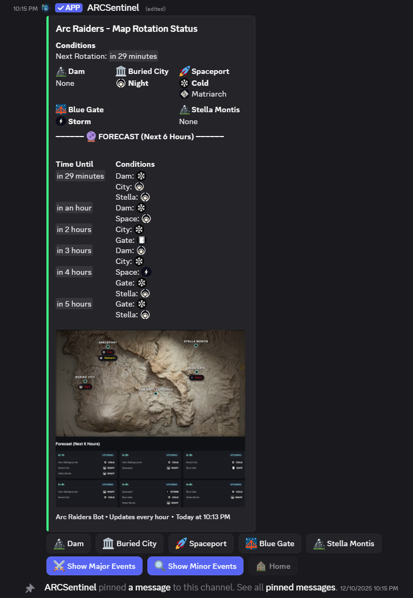
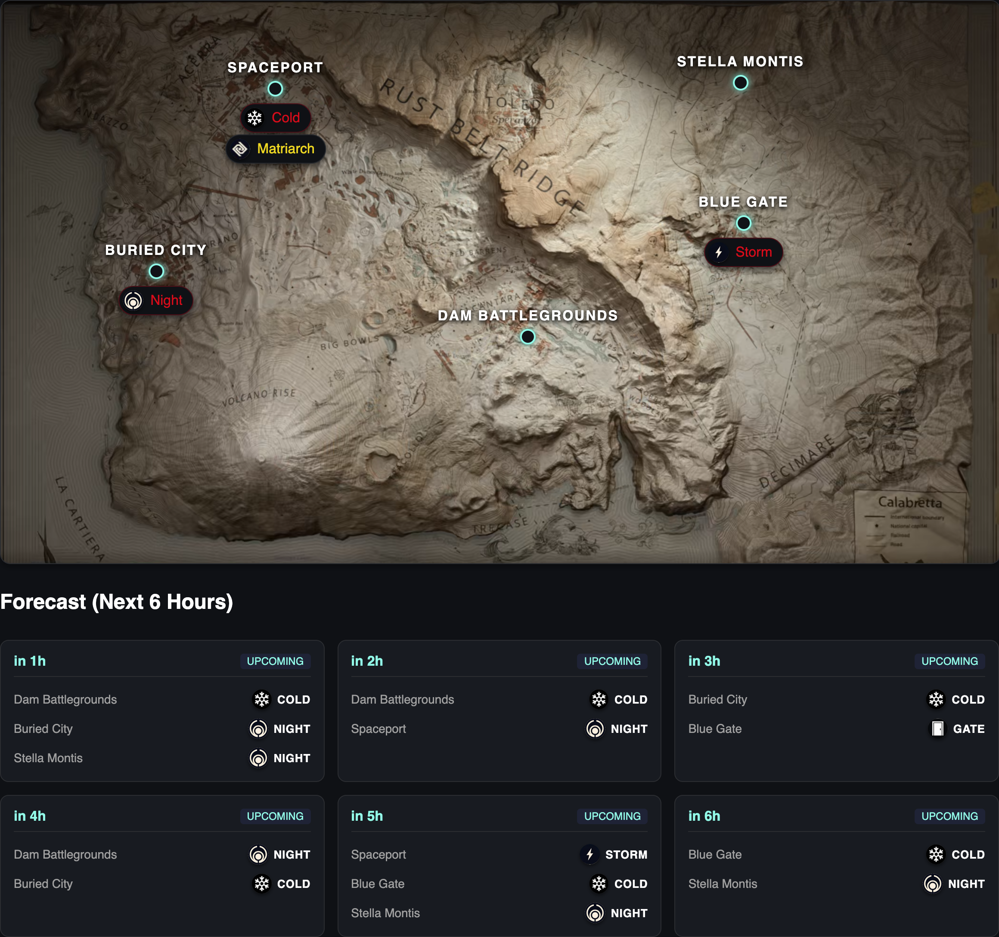

<p align="center">
  
</p>

<h1 align="center">ARCSentinel Discord Bot</h1>

<p align="center">
  <a href="https://github.com/zfael/arc-raiders-discord-bot/actions/workflows/build.yml"></a>
  <a href="https://nodejs.org/"></a>
  <a href="LICENSE"></a>
</p>

<p align="center">
  <strong>A feature-rich Discord bot that tracks and displays Arc Raiders map rotation conditions across all five maps with automatic hourly updates, interactive navigation, visual map generation, and multi-language support.</strong>
</p>

<p align="center">
  <a href="#preview">Preview</a> •
  <a href="#quick-start">Quick Start</a> •
  <a href="#features">Features</a> •
  <a href="#installation">Installation</a> •
  <a href="#database-setup">Database Setup</a> •
  <a href="#commands">Commands</a>
</p>

---

## Preview

Discord Embed View | Generated Map Image
:-------------------------:|:-------------------------:
 | 
*Live rotation status with interactive controls* | *Visual map with 6-hour forecast*

---

## Quick Start

### Add the Bot to Your Server

You can invite ARCSentinel Discord Bot to any Discord server using this link:

<p align="center">
  <a href="https://discord.com/oauth2/authorize?client_id=1442592163983528056">
    
  </a>
</p>

**After inviting:**

1. **Set the update channel** using the `/set-channel` slash command in the channel where you want map rotation updates to appear *(Admin only)*
2. The bot will automatically post and update the Arc Raiders map rotation status every hour
3. **(Optional)** Use `/settings` to customize language, mobile mode, or notification style

---

## Features

### Map Rotation Tracking

| Map | Description |
|-----|-------------|
| **Dam Battlegrounds** | Industrial zone with varied terrain |
| **Buried City** | Urban ruins with vertical gameplay |
| **Spaceport** | Open areas with crashed spacecraft |
| **Blue Gate** | Mountainous region with unique events |
| **Stella Montis** | High-altitude snowy terrain |

### Events & Conditions

The bot tracks all event types across every map, updating in real-time with the official UTC rotation schedule.

<table>
<tr>
<td width="50%" valign="top">

#### Major Events (2x Multiplier)

| Event | Description |
|-------|-------------|
| 🌙 **Night** | Darkness conditions with reduced visibility |
| ⚡ **Storm** | Electrical hazards across the map |
| ❄️ **Cold** | Freezing temperatures and environmental danger |
| 🚪 **Gate** | Special gate access event |
| 👑 **Matriarch** | Boss encounter opportunity |
| 🏗️ **Tower** | Space tower loot availability |
| 🏚️ **Bunker** | Bunker access unlocked |

</td>
<td width="50%" valign="top">

#### Minor Events

| Event | Description |
|-------|-------------|
| 🤖 **Harvester** | High-value target roaming the map |
| 💀 **Husks** | Enemy husk encounters |
| 🌸 **Blooms** | Lush vegetation spawns |
| 📦 **Caches** | Additional loot caches |
| 🛸 **Probes** | Probe spawn opportunities |

</td>
</tr>
</table>

### Notification Methods

Choose how the bot updates your server:

| Method | Description |
|--------|-------------|
| **📌 Pin & Edit** | Single pinned message that updates (default) |
| **🔄 Post & Delete** | New message each hour, old one deleted |
| **📝 Post & Keep** | New message each hour, history preserved |

### Multi-Language Support

The bot is fully localized and supports:

- 🇺🇸 **English** (default)
- 🇪🇸 **Español** (Spanish)
- 🇫🇷 **Français** (French)
- 🇧🇷 **Português Brasileiro** (Brazilian Portuguese)

Use `/settings locale:` to change your server's language!

### Visual Map Generation

Beautiful generated map images showing:
- Current active events at each location
- Visual markers with event icons
- 6-hour forecast panel
- Localized location and event names

### Mobile-Friendly Mode

Toggle a single-column optimized layout for mobile users with `/settings mobile-friendly: True`

### Interactive Controls

Navigate through maps and events using button controls:
- **🏠 Home** — Return to overview of all maps
- **🗺️ View Map** — See visual map with event overlays
- **⚔️ Major Events** — Filter to show only major events
- **📦 Minor Events** — Filter to show only minor events

**Interaction Priority System:** When you click a button, you gain exclusive control for 15 seconds to prevent conflicts. After inactivity, the message returns to home screen.

---

## Installation

### Prerequisites

- **Docker** and Docker Compose *(recommended)* **OR** Node.js 24.x
- Discord Bot Token from [Discord Developer Portal](https://discord.com/developers/applications)
- Supabase project with URL and Service Role key

### Option 1: Docker (Recommended)

Pre-built multi-architecture images are available on GitHub Container Registry.

#### Using Docker Compose

**1. Create a `.env` file:**

```env
# Discord Bot Configuration
DISCORD_TOKEN=your_bot_token_here
CLIENT_ID=your_client_id_here

# Supabase Configuration
SUPABASE_URL=https://your-project.supabase.co
SUPABASE_SERVICE_ROLE_KEY=your_service_role_key

# Optional Settings
LOG_LEVEL=info
PORT=6767
```

**2. Create a `docker-compose.yml` file:**

```yaml
services:
  arc-raiders-bot:
    image: ghcr.io/zfael/arc-raiders-discord-bot:latest
    container_name: arc-raiders-discord-bot
    restart: unless-stopped
    init: true
    env_file:
      - .env
    ports:
      - "6767:6767"
    environment:
      - TZ=UTC
```

**3. Start the bot:**

```bash
docker-compose up -d
```

**4. View logs:**

```bash
docker-compose logs -f
```

**5. Stop the bot:**

```bash
docker-compose down
```

#### Using Docker Run

```bash
docker run -d \
  --name arc-raiders-discord-bot \
  --restart unless-stopped \
  -p 6767:6767 \
  --env-file .env \
  ghcr.io/zfael/arc-raiders-discord-bot:latest
```

#### Available Image Tags

| Tag | Description |
|-----|-------------|
| `latest` | Latest stable release from main branch |
| `v1.0.0` | Specific version tags |
| `main` | Latest commit on main branch (may be unstable) |

#### Multi-Architecture Support

Images are built for:
- `linux/amd64` (x86_64 / Intel/AMD)
- `linux/arm64` (ARM64 / Apple Silicon / Raspberry Pi)

Docker will automatically pull the correct architecture for your system.

---

### Option 2: Manual Installation

**1. Clone the repository:**

```bash
git clone https://github.com/zfael/arc-raiders-discord-bot.git
cd arc-raiders-discord-bot
```

**2. Install dependencies:**

```bash
npm install
```

**3. Configure environment variables:**

```bash
cp .env.example .env
```

Edit `.env` and fill in your values:

```env
DISCORD_TOKEN=your_bot_token_here
CLIENT_ID=your_client_id_here
SUPABASE_URL=https://your-project.supabase.co
SUPABASE_SERVICE_ROLE_KEY=your_service_role_key
```

**4. Deploy slash commands:**

```bash
npm run deploy-commands
```

> ⚠️ Global commands can take up to an hour to propagate to all servers.

**5. Start the bot:**

```bash
# Development (with hot reloading)
npm run dev

# Production
npm run build
npm start
```

---

## Database Setup

This bot uses **Supabase** for persistent storage of server configurations.

### 1. Create a Supabase Project

1. Go to [supabase.com](https://supabase.com) and create a new project
2. Note your **Project URL** and **Service Role Key** from Settings > API

### 2. Create the Database Table

Run this SQL in the Supabase SQL Editor:

```sql
-- Create servers table for storing bot configuration per guild
CREATE TABLE IF NOT EXISTS public.servers (
  guild_id TEXT PRIMARY KEY,
  channel_id TEXT NOT NULL,
  server_name TEXT,
  message_id TEXT,
  last_updated TEXT,
  mobile_friendly BOOLEAN DEFAULT FALSE,
  locale TEXT DEFAULT 'en',
  notification_method TEXT DEFAULT 'pin-edit',
  created_at TIMESTAMPTZ DEFAULT TIMEZONE('utc', NOW()),
  updated_at TIMESTAMPTZ DEFAULT TIMEZONE('utc', NOW())
);

-- Create index for faster lookups
CREATE INDEX IF NOT EXISTS idx_servers_notification_method 
  ON public.servers(notification_method);

-- Enable Row Level Security (optional but recommended)
ALTER TABLE public.servers ENABLE ROW LEVEL SECURITY;

-- Create update trigger for updated_at
CREATE OR REPLACE FUNCTION update_updated_at_column()
RETURNS TRIGGER AS $$
BEGIN
  NEW.updated_at = TIMEZONE('utc', NOW());
  RETURN NEW;
END;
$$ LANGUAGE plpgsql;

CREATE TRIGGER update_servers_updated_at
  BEFORE UPDATE ON public.servers
  FOR EACH ROW
  EXECUTE FUNCTION update_updated_at_column();
```

### 3. Table Schema Reference

| Column | Type | Description |
|--------|------|-------------|
| `guild_id` | TEXT (PK) | Discord server ID |
| `channel_id` | TEXT | Channel for map updates |
| `server_name` | TEXT | Server name for logging |
| `message_id` | TEXT | ID of current/pinned message |
| `last_updated` | TEXT | Last update timestamp |
| `mobile_friendly` | BOOLEAN | Mobile-friendly mode setting |
| `locale` | TEXT | Server language preference |
| `notification_method` | TEXT | How updates are posted |
| `created_at` | TIMESTAMPTZ | Row creation time |
| `updated_at` | TIMESTAMPTZ | Last modification time |

### 4. Environment Configuration

Add these to your `.env` file:

```env
SUPABASE_URL=https://your-project-id.supabase.co
SUPABASE_SERVICE_ROLE_KEY=eyJhbGciOiJIUzI1NiIsInR5cCI6IkpXVCJ9...
```

> 💡 The bot uses the **Service Role Key** which bypasses Row Level Security. Keep this key secure!

---

## Discord Bot Setup

### 1. Create a Discord Application

1. Go to [Discord Developer Portal](https://discord.com/developers/applications)
2. Click **"New Application"** and give it a name
3. Go to the **"Bot"** section and click **"Add Bot"**
4. Copy the bot token — this is your `DISCORD_TOKEN`
5. Enable these **Privileged Gateway Intents**:
   - ✅ Presence Intent
   - ✅ Server Members Intent
   - ✅ Message Content Intent

### 2. Get Your Client ID

Found in the **"General Information"** section of your application. This is your `CLIENT_ID`.

### 3. Upload Custom Emojis

1. Go to your application's **"Emojis"** section in the Developer Portal
2. Upload the emoji images from `src/assets/` directory:

| File | Event |
|------|-------|
| `harvester.png` | Harvester |
| `nightraid.png` | Night |
| `husks.png` | Husks |
| `lush.png` | Blooms |
| `electro.png` | Storm |
| `cache.png` | Caches |
| `probe.png` | Probes |
| `spacetower_loot.png` | Tower |
| `bunker.png` | Bunker |
| `matriarch.png` | Matriarch |
| `cold.png` | Cold |
| `gate.png` | Gate |

3. Copy each emoji ID and update `CONDITION_EMOJIS` in `src/config/mapRotation.ts`

### 4. Bot Permissions

The bot requires these permissions (permission integer: **274877925376**):

- ✅ Send Messages
- ✅ Embed Links
- ✅ Manage Messages (for pinning)
- ✅ Read Message History
- ✅ Attach Files (for map images)

### 5. Invite the Bot

1. Go to **OAuth2 > URL Generator** in the Developer Portal
2. Select scopes: `bot` and `applications.commands`
3. Select the permissions listed above
4. Copy the generated URL and open it in your browser
5. Select your server and authorize the bot

---

## Commands

| Command | Description | Permissions |
|---------|-------------|-------------|
| `/ping` | Check bot latency and responsiveness | Everyone |
| `/set-channel` | Set the channel for map rotation updates | Administrator |
| `/settings` | Configure bot settings (language, mobile mode, notifications) | Administrator |
| `/translations` | Learn how to contribute translations | Everyone |

### Settings Options

```
/settings mobile-friendly: <True/False>
/settings locale: <English/Español/Français/Português>
/settings notification-method: <pin-edit/post-delete/post-keep>
```

---

## Development

### Code Quality

This project uses [Biome.js](https://biomejs.dev/) for linting and formatting:

```bash
npm run lint        # Check for issues
npm run lint:fix    # Auto-fix issues
```

### Building

```bash
npm run build       # Compile TypeScript and copy assets
npm run clean       # Remove dist/ directory
```

### Map Image Generation

Pre-generate map images for all hours and locales:

```bash
npm run setup:generator  # Install generator dependencies
npm run generate-maps    # Generate all map images
```

---

## Troubleshooting

<details>
<summary><strong>Bot doesn't respond to commands</strong></summary>

- Run `npm run deploy-commands` to register slash commands
- Global commands can take up to an hour to propagate
- Check that the bot has proper permissions in the server

</details>

<details>
<summary><strong>Map rotation message not appearing</strong></summary>

- Use `/set-channel` to designate a channel for updates
- Check the bot has Send Messages, Embed Links, Attach Files, and Manage Messages permissions
- Check the bot's console logs for error messages

</details>

<details>
<summary><strong>Interactive buttons not working</strong></summary>

- Ensure the bot has Read Message History permission
- Verify the message hasn't been deleted or unpinned
- Check console logs for interaction errors

</details>

<details>
<summary><strong>Bot crashes on startup</strong></summary>

- Verify all required environment variables are set
- Check that the Discord token is valid
- Ensure the bot is invited to the server
- Verify Supabase credentials are correct

</details>

<details>
<summary><strong>TypeScript errors</strong></summary>

- Run `npm install` to ensure all dependencies are installed
- Check that Node.js version is 24.x or higher
- Run `npm run lint` to check for code issues

</details>

---

## How It Works

### Startup & Scheduling

1. **Startup** — Bot logs in and immediately posts/updates the map rotation status
2. **Scheduling** — A cron job runs at the top of every hour (UTC) to update all server messages
3. **Updates** — The bot fetches current and next rotation from the 24-hour schedule

### Message Management

- Reads the stored `message_id` for each channel from Supabase
- Edits the existing pinned message or creates/pins a new one when needed
- Writes the latest `message_id`/`last_updated` back to Supabase
- Generates visual map images based on current rotation

### Persistence

All configuration and message metadata lives in Supabase, so the bot resumes seamlessly after restarts.

---

## Contributing

Contributions are welcome! Please see [CONTRIBUTING.md](CONTRIBUTING.md) for guidelines.

### Quick Start for Contributors

1. Fork the repository
2. Create a feature branch
3. Make your changes
4. Run `npm run lint:fix` to format code
5. Test your changes thoroughly
6. Submit a pull request

### Help Translate

Want to see this bot in your language? Check out the `/translations` command in Discord or add a new locale file to `src/locales/`!

---

## License

This project is licensed under the MIT License - see the [LICENSE](LICENSE) file for details.

---

<p align="center">
  <strong>Questions or Issues?</strong><br>
  <a href="https://github.com/zfael/arc-raiders-discord-bot/issues">Open an issue on GitHub</a>
</p>

<p align="center">
  Made with ❤️ for the Arc Raiders community
</p>
